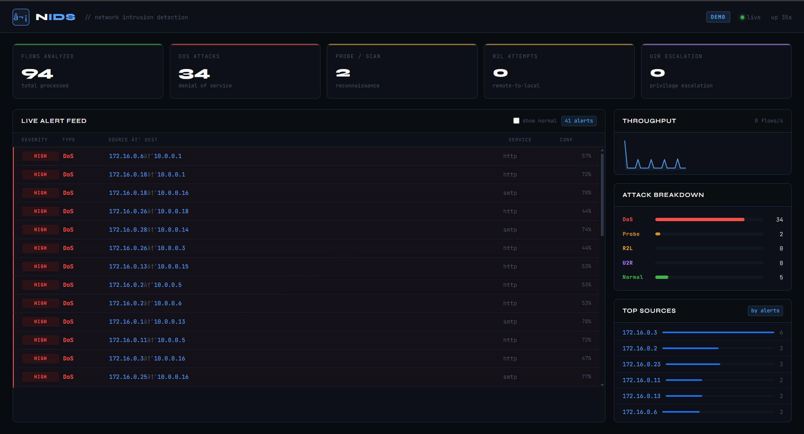

# NIDS — Network Intrusion Detection System

[](https://python.org)
[](/)
[](/)
[](/)

A fully functional, ML-powered network intrusion detection system. Captures live packets, extracts KDD-compatible flow features in real time, and classifies traffic as **Normal, DoS, Probe, R2L, or U2R** — with a live dashboard, WebSocket alert streaming, and one-command Docker deploy.

---

## Demo

```bash
git clone https://github.com/yashdhone01/nids-ml-engine
cd nids-ml-engine
docker compose up --build
```

No root access, no network interface, no setup. The demo mode generates a realistic mix of attack and normal traffic so the dashboard is live immediately.



---

## Architecture

```
Network Interface
      │
      ▼
┌─────────────────┐
│  PacketCapture  │  Scapy · raw socket · flow assembly by 5-tuple
└────────┬────────┘
         │  FlowRecord
         ▼
┌─────────────────┐
│FeatureExtractor │  19 KDD-compatible features
│                 │  · rolling 2s traffic window
│                 │  · per-host connection table
└────────┬────────┘
         │  feature dict
         ▼
┌─────────────────┐
│   NIDSEngine    │  Random Forest · 99.93% accuracy
│                 │  · LabelEncoder persistence
│                 │  · StandardScaler
└────────┬────────┘
         │  Alert
         ▼
┌─────────────────┐     WebSocket
│   FlowMonitor   │ ──────────────► Dashboard
│   + FastAPI     │     REST API
└─────────────────┘
```

The system is **stateful**. A single isolated packet cannot be reliably classified — the detector maintains a rolling 2-second window and a per-host connection history to compute features like `serror_rate`, `dst_host_diff_srv_rate`, and `rerror_rate`. This matches how production IDS systems (Snort, Zeek, Suricata) work.

---

## Detection

| Category | Examples | Key Signal |
|----------|----------|------------|
| **DoS** | neptune, smurf, teardrop | `count` > 200, `serror_rate` ≈ 1.0 |
| **Probe** | portsweep, nmap, satan | `diff_srv_rate` ≈ 1.0, `rerror_rate` ≈ 1.0 |
| **R2L** | guess_passwd, warezclient | isolated connection, large `dst_bytes` |
| **U2R** | buffer_overflow, rootkit | rare, low-volume, elevated privilege signals |

### Model performance

| Model | Accuracy |
|-------|----------|
| Logistic Regression | 81.74% |
| Decision Tree | 99.89% |
| **Random Forest** | **99.93%** |

Trained on KDD Cup 99 (494K records). U2R recall is **80%** — most implementations score 40–60% due to class imbalance (52 U2R samples vs 391K DoS). Fixed with SMOTE-style class weighting.

### Why 19 features, not 41?

The original KDD99 dataset has 41 features. Features 10–22 (content features: `logged_in`, `num_failed_logins`, `num_shells`, etc.) require deep packet inspection of application-layer payloads — they can't be computed from TCP/IP headers alone. The remaining 26 are computable from raw packets; we use the 19 that contribute most information gain, dropping redundant rate features that correlate > 0.95 with included ones.

The 4 host-based features added beyond the common 15-feature baseline (`dst_host_count`, `dst_host_srv_count`, `dst_host_diff_srv_rate`, `dst_host_rerror_rate`) are critical for separating **Probe from DoS** — a portsweep has `dst_host_diff_srv_rate ≈ 1.0` while a SYN flood has it near 0.

---

## Running

### Demo mode — no root, no interface (any OS)

```bash
# With Docker
docker compose up --build
# open http://localhost:8000

# Without Docker
pip install -r requirements.txt
python -m src.train
$env:NIDS_DEMO="1"; uvicorn src.api:app --host 0.0.0.0 --port 8000  # Windows
NIDS_DEMO=1 uvicorn src.api:app --host 0.0.0.0 --port 8000           # Linux/Mac
# open http://127.0.0.1:8000
```

### Live capture mode — Linux, requires root

```bash
# Check your interface name
ip link show

# Start live detection
sudo NIDS_INTERFACE=eth0 uvicorn src.api:app --host 0.0.0.0 --port 8000

# Terminal-only (no dashboard)
sudo python -m src.monitor --interface eth0 --log alerts.ndjson
```

### Docker live mode

```bash
NIDS_INTERFACE=eth0 docker compose -f docker-compose.live.yml up --build
```
---

## Dashboard

The dashboard connects over WebSocket and updates in real time:

- **Live alert feed** — severity-coded rows (red=DoS, magenta=U2R, yellow=Probe)
- **Attack breakdown** — animated bar chart per category
- **Throughput sparkline** — flows/second over time
- **Top sources** — ranked attacker IPs by alert count
- **Stats** — total flows analyzed, per-category counts, uptime

All data is streamed as NDJSON. The `/api/alerts` endpoint serves the last 500 alerts for any external tooling (Splunk, ELK, Grafana).

---

## API

```
GET  /              Dashboard UI
GET  /api/stats     Pipeline stats (flows, alerts, uptime, mode)
GET  /api/alerts    Alert history, last 500 (JSON)
WS   /ws/alerts     Real-time alert stream (one JSON object per alert)
```

Alert schema:
```json
{
  "timestamp": 1711234567.4,
  "src_ip": "172.16.0.5",
  "dst_ip": "10.0.0.1",
  "src_port": 54321,
  "dst_port": 80,
  "protocol": "tcp",
  "service": "http",
  "prediction": "DoS",
  "confidence": 0.91,
  "severity": "HIGH",
  "duration": 0.0,
  "src_bytes": 0,
  "dst_bytes": 0,
  "flag": "S0"
}
```
---

## Feedback

Open an [issue](https://github.com/yashdhone01/nids-ml-engine/issues) or find me on
[Twitter](https://x.com/Yash354642) · [Portfolio](https://yashdhone.vercel.app)